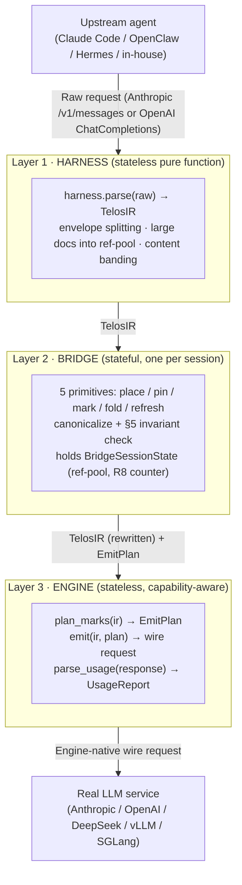

TELOS is three layers. The harness turns an upstream request into the canonical IR; the bridge applies
policy and holds the only cross-request state; the engine emits an engine-native wire request. The IR
in the middle is the **only contract** — the harness does not know the engine, the engine does not
know the harness.



<Note>
  **Core invariant.** Cross-request state can only exist in Layer 2. Both the harness and the engine
  are pure functions / stateless objects: the same input always produces the same result.
</Note>

`registry.py` provides `load_harness(name)` / `load_engine(name)`, so the bridge never directly
imports a concrete implementation — this is how "the three layers only pass values downward" is
realized in code.

## Layer 1 · Harness

Each harness plugin is a pure stateless function: `parse(raw) → TelosIR`. It splits the user envelope,
moves large docs into the ref-pool, and bands every block PIN / FOLD / DROP.

The three built-in harnesses differ mostly in wire shape and identity markers:

| | OpenClaw | Hermes | Telos |
|---|---|---|---|
| Wire shape | Anthropic `/v1/messages` | Anthropic `/v1/messages` | OpenAI ChatCompletions |
| Identity markers | default / fallback | `<system-reminder>`, `<command-message>`, thinking blocks, the Claude Code tool set | standalone transport |
| `source_tag` prefix | `openclaw/*` | `hermes/*` | `telos/*` |

See [Harness integration](/en/guides/harnesses) for detection and routing.

## Layer 2 · Bridge

One instance per session, **stateful**. It exposes five primitives — `place`, `pin`, `mark`, `fold`,
`refresh` — and runs canonicalization plus the §5 invariant check before every emit:

```python
def emit_with_plan(self) -> tuple[wire, EmitPlan]:
    canon = _canonicalize_ir(self._ir)        # ① Canonicalize (key sort, tool sort)
    assert_ir_invariants(canon)               # ② Full §5 check (last line of defense)
    refpool.lint_blocks(...)                  # ③ Scan [ref:slug] references, fail-fast on unregistered
    plan = engine.plan_marks(canon)           # ④ Engine decides the anchor positions
    wire = engine.emit(canon, plan)           # ⑤ Engine produces the wire
    return wire, plan
```

Canonicalization fixes cross-language JSON key disorder (Swift/Go randomize key order, breaking the
prefix hash) by sorting dict keys, JSON-Schema set arrays (`required`), and the tool array
(`source_rank, mcp_server, name`). Cross-turn state lives in `BridgeSessionState`; see
[Multi-turn state](/en/guides/multi-turn-state).

## Layer 3 · Engine

Stateless and capability-aware. The bridge programs only against the abstract `EngineAdapter`
interface and never branches by engine name:

- `capabilities → EngineCapabilities`
- `plan_marks(ir) → EmitPlan` — decides the anchor positions
- `emit(ir, plan) → wire dict`
- `parse_usage(response) → UsageReport`

Only Anthropic has explicit breakpoints (max 4). vLLM and SGLang additionally implement
`BidirectionalEngineAdapter` (cache probe, span eviction, fork-and-replace). The bridge relies on
`isinstance` to guarantee it never calls a bidirectional method on a closed-source API.

<Card title="Full architecture reference" icon="book" href="/en/reference/architecture-reference">
  Every data structure, primitive, engine strategy, invariant, and extension point — the authoritative
  deep dive.
</Card>

## The orthogonal second line · RTK

What TELOS stabilizes is the request *prefix*. Each turn the agent also appends large chunks of tool
output to the *tail*. The [RTK output filtering layer](/en/concepts/rtk) compresses that repetitive
tail — an independent optimization controlled by the same four-state `TelosMode` switch.
