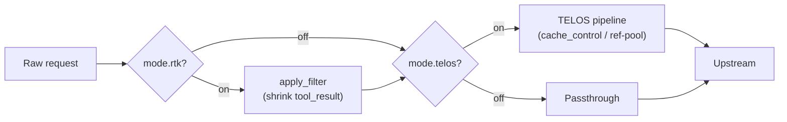

TELOS stabilizes the request **prefix** (system / tools / conversation prefix) to win the KV cache.
But each round, the agent also appends large chunks of tool output — bash / pytest / docker logs — to
the **tail** of the conversation. TELOS absorbed the ideas of
[rtk-ai/rtk](https://github.com/rtk-ai/rtk) and added an orthogonal **RTK output filtering** layer:
before a request enters the TELOS pipeline, it compresses the large repetitive output in
`tool_result`.

<Note>
  The two lines are independent. TELOS shrinks what you pay full price for *again* (the prefix);
  RTK shrinks what you add as *new* tokens each round (the tool tail). They are controlled separately
  by the `TelosMode` four-state switch.
</Note>

## The four-state switch

```python
@dataclass(frozen=True)
class TelosMode:
    telos: bool = True    # Run the TELOS pipeline (cache_control / ref-pool)
    rtk:   bool = False   # Run RTK tool result filtering
```

| label | telos | rtk | Meaning |
|---|:---:|:---:|---|
| `none` | ✗ | ✗ | Pure passthrough — the proxy does not change a single byte |
| `telos` | ✓ | ✗ | TELOS prefix caching only (proxy default) |
| `rtk` | ✗ | ✓ | RTK tool filtering only, no cache markers applied |
| `both` | ✓ | ✓ | Both enabled |

An unknown or empty value degrades to the default `telos`, preserving the historical behavior from
before the switch was introduced. Switch it live:

```bash
telos mode both    # hot-reloads the running gateway and persists the choice
```

## The filters

- **`RtkFilter`** — shells out to the `rtk` binary (`rtk filter --command <cmd>` reading stdin). Any
  failure degrades to passthrough.
- **`FallbackFilter`** — a dependency-free pure-Python filter: consecutive repeated lines folded into
  `<line> (×N)`, head/tail truncation, pytest summary preserved. Guarantees the switch still takes
  effect when `rtk` is not installed.
- **`CompositeFilter`** — runs rtk first; if it saves no bytes, falls back to the fallback filter.
- **`build_filter()`** — rtk available → `Composite(rtk, fallback)`, otherwise a pure `FallbackFilter`.

**Thresholds:** output shorter than 600 chars is not filtered; after dedup, output over 4000 chars
goes through head/tail truncation.

## How it's wired into the proxy



- The `--mode` CLI switch plus the `X-Telos-Mode` header (sticky to the session on the first request).
- `mode.rtk` on → `apply_filter` runs *before* the TELOS pipeline.
- `mode.telos` off → skip the pipeline and go straight to passthrough.
- `apply_filter(raw, flt)` is a pure function: it deep-copies the request, rewrites the text of every
  `tool_result` (both the string and block-list content forms), and looks up the command hint from the
  previous assistant message's `tool_use`.
- `usage_log` gains the `mode` / `compare_group` / `tool_output_reduction` fields.

<Card title="Architecture" icon="sitemap" href="/en/concepts/architecture">
  Where RTK sits relative to the harness → bridge → engine pipeline.
</Card>
