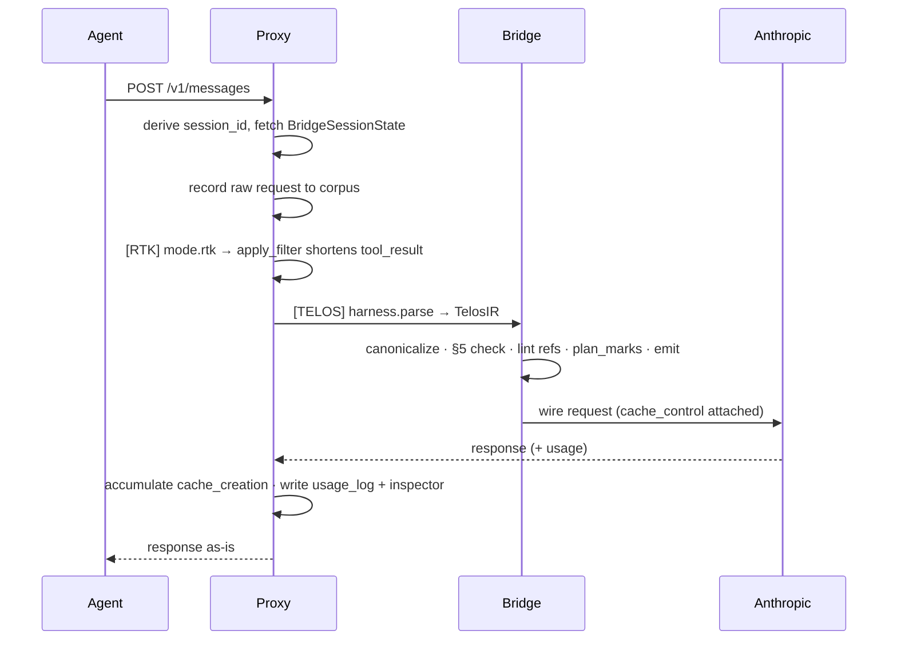

There are two ways to put TELOS in front of your model API. They run the **same TELOS pipeline**, the
**same state accumulation**, and the **same `cache_control` injection** — the only differences are the
process boundary, error handling, and streaming.

<CardGroup cols={2}>
  <Card title="Path B · HTTP reverse proxy" icon="network-wired" href="/en/guides/proxy-gateway">
    **Recommended.** Zero code changes — set `ANTHROPIC_BASE_URL` to the local gateway. This is what
    `telos init` configures.
  </Card>
  <Card title="Path A · SDK transport" icon="code" href="/en/guides/sdk-transport">
    In-process. Swap the LLM client for the TELOS transport; the duck interface is identical.
  </Card>
</CardGroup>

## How they compare

| | Path B · Proxy | Path A · SDK transport |
|---|---|---|
| Integration | `ANTHROPIC_BASE_URL` env var, zero code change | swap the client object |
| Process model | out-of-process (separate gateway) | in-process |
| Streaming | SSE-aware reverse proxy | direct SDK streaming |
| Session state | keyed by `session_id` in an LRU registry | one `BridgeSessionState` per transport instance |
| Best for | any harness that respects `ANTHROPIC_BASE_URL` / `OPENAI_BASE_URL` | apps you control the source of |
| Failure mode | non-strict by default: degrades to passthrough | raises in-process |

<Note>
  Both paths share the same pure function — `proxy/pipeline.py:process_anthropic_request(raw, ...)`
  splits out parse → bridge → emit, eliminating any wire drift between the two.
</Note>

## A request, end to end (Path B, `mode=both`)

## Pick one

- **You run a CLI agent (Claude Code, Codex, OpenClaw, Hermes).** Use Path B — run `telos init` and
  you're done. See [Harness integration](/en/guides/harnesses).
- **You're building your own agent in Python.** Either works; Path A keeps everything in-process. See
  [SDK transport](/en/guides/sdk-transport).
