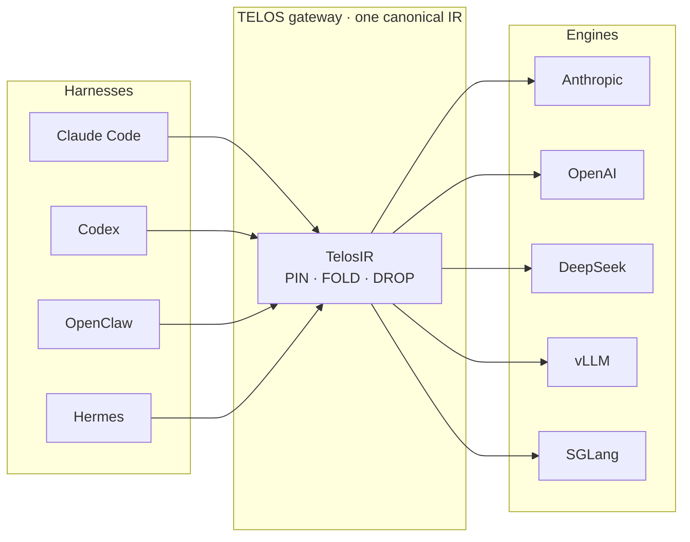

<Frame>
  
</Frame>

**One canonical IR — tools, system, turns, and memory — runs unchanged across Anthropic ·
OpenAI · DeepSeek · vLLM · SGLang.** Most agent frameworks treat the KV cache as a runtime gift the
inference engine may or may not hand you. TELOS inverts that: cache reuse becomes a *structural
property of the prompt itself*. Stabilize the bytes that are genuinely stable, and the cache cannot
be invalidated.

<Note>
  Real 6-turn session **−92.3%**. Cost reported in absolute **\$/query-resolved** — ratios can be
  gamed; dollars can't. From the [LEAP Lab @ Tsinghua University](https://www.leaplab.ai/).
</Note>

<Columns cols={3}>
  <Card title="Quickstart" icon="rocket" href="/en/start/quickstart">
    Install, connect, and watch the savings in three commands.
  </Card>
  <Card title="The Protocol" icon="sparkles" href="/en/concepts/protocol">
    Three-color bands and monotonic append — why the cache *cannot* break.
  </Card>
  <Card title="Support Matrix" icon="layout-dashboard" href="/en/reference/support-matrix">
    Harnesses, frontier models, and self-hosted inference frameworks.
  </Card>
</Columns>

## Why TELOS

TELOS solves exactly two things.

<CardGroup cols={2}>
  <Card title="Push token efficiency to the limit" icon="gauge-high">
    A 6-turn real session drops **−92.3%**; a controlled 48-call run drops **−36.6% (net −\$2.16)**.
    Every cent is accounted for in absolute \$/query-resolved.
  </Card>
  <Card title="Return context sovereignty to you" icon="shield-halved">
    `TelosIR` is an engine-agnostic, serializable, portable context representation — your persona,
    your tools, your 20-turn thread, all on the same **stone tablet**. Hand it to Claude today,
    move it to DeepSeek tomorrow, run it on local vLLM tonight.
  </Card>
</CardGroup>

## Key capabilities

<CardGroup cols={3}>
  <Card title="Three-color bands" icon="layer-group" href="/en/concepts/bands">
    Every block declares its cache lifetime at birth: PIN / FOLD / DROP.
  </Card>
  <Card title="Monotonic append" icon="arrow-down-wide-short" href="/en/concepts/protocol">
    The prompt is an append-only stream — submitted bytes are never mutated.
  </Card>
  <Card title="Multi-engine adapters" icon="plug" href="/en/concepts/architecture">
    Anthropic, OpenAI, DeepSeek, vLLM and SGLang from one IR.
  </Card>
  <Card title="RTK output filtering" icon="filter" href="/en/concepts/rtk">
    An orthogonal layer that shrinks repetitive `tool_result` tails.
  </Card>
  <Card title="Savings dashboard" icon="chart-line" href="/en/observability/savings-dashboard">
    Offline HTML, savings pinned to absolute dollars.
  </Card>
  <Card title="Zero-intrusion proxy" icon="network-wired" href="/en/guides/proxy-gateway">
    Point `ANTHROPIC_BASE_URL` at the local gateway — no code changes.
  </Card>
</CardGroup>

## 2 a.m. — where did all the money go?

The counter climbs to 2,847,103 tokens, and the line above reads `cache_read: 0`. All night, every
turn fed the same 4,000-token system prompt **from scratch**, billed at full price. Take the exact
same 6-turn conversation, drop it into TELOS, and flip two switches:

| Mode | raw input tokens | cache_read | Cost for 6 turns |
|---|:--:|:--:|:--:|
| passthrough (today's default) | 24,151 | 0 | **\$0.3623** |
| with TELOS | 0 | 18,701 | **\$0.0281 (−92.3%)** |

Scale to 1,000 sessions: **\$362 → \$26**.

<Frame caption="Today's agent token efficiency is only ~25% — the reusable bytes are billed at full price every turn.">
  
</Frame>

## Three steps to save 90%

<Steps>
  <Step title="Install">
    ```bash
    # Linux / macOS / WSL2 / Android (Termux)
    curl -fsSL https://raw.githubusercontent.com/learningCatHD/telos-sdk/main/scripts/install.sh | bash
    # or: pip install -U telos-sdk
    ```
  </Step>
  <Step title="Connect">
    ```bash
    telos init
    ```
    Auto-detects **claude-code / codex / openclaw / hermes**, injects config into each, and starts
    the local gateway in the background. No changes to your agent code.
  </Step>
  <Step title="Observe">
    ```bash
    telos dashboard
    ```
    Opens an offline HTML dashboard showing savings per call in absolute dollars.
  </Step>
</Steps>

## How it fits together



## Learn more

<CardGroup cols={3}>
  <Card title="Architecture" icon="sitemap" href="/en/concepts/architecture">
    The three-layer harness → bridge → engine design.
  </Card>
  <Card title="SWE-bench A/B" icon="flask" href="/en/benchmark/swebench">
    Pre-registered study: half the input bill, no resolved-rate regression.
  </Card>
  <Card title="CLI Reference" icon="terminal" href="/en/reference/cli">
    Every `telos` subcommand and flag.
  </Card>
</CardGroup>
