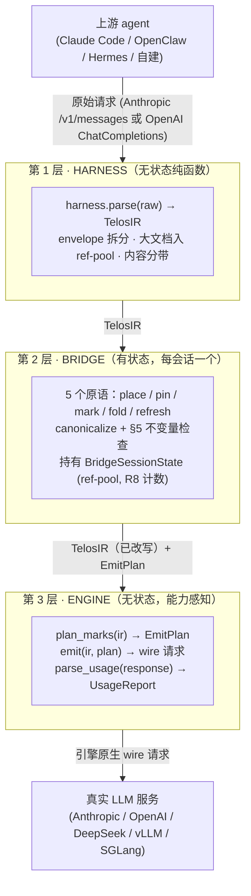

TELOS 是三层。harness 把上游请求转成规范 IR；bridge 施加策略并持有唯一的跨请求状态；engine 产出
引擎原生的 wire 请求。中间的 IR 是**唯一契约**——harness 不知道 engine，engine 不知道 harness。



<Note>
  **核心不变量。** 跨请求状态只能存在于第 2 层。harness 与 engine 都是纯函数 / 无状态对象：相同输入永远
  产生相同结果。
</Note>

`registry.py` 提供 `load_harness(name)` / `load_engine(name)`，因此 bridge 从不直接 import 任何具体
实现——这就是"三层只向下传值"在代码层的实现。

## 第 1 层 · Harness

每个 harness 插件是纯无状态函数 `parse(raw) → TelosIR`。它拆分用户 envelope，把大文档移入 ref-pool，并把
每个块分带为 PIN / FOLD / DROP。

三个内建 harness 主要在 wire 形态与身份标记上有别：

| | OpenClaw | Hermes | Telos |
|---|---|---|---|
| Wire 形态 | Anthropic `/v1/messages` | Anthropic `/v1/messages` | OpenAI ChatCompletions |
| 身份标记 | 默认 / 兜底 | `<system-reminder>`、`<command-message>`、thinking 块、Claude Code 工具集 | 独立 transport |
| `source_tag` 前缀 | `openclaw/*` | `hermes/*` | `telos/*` |

检测与路由见 [Harness 集成](/zh/guides/harnesses)。

## 第 2 层 · Bridge

每会话一个实例，**有状态**。它暴露五个原语——`place`、`pin`、`mark`、`fold`、`refresh`，并在每次 emit
之前执行 canonicalize 与 §5 不变量检查：

```python
def emit_with_plan(self) -> tuple[wire, EmitPlan]:
    canon = _canonicalize_ir(self._ir)        # ① 规范化（键序、工具序）
    assert_ir_invariants(canon)               # ② 完整 §5 检查（最后防线）
    refpool.lint_blocks(...)                  # ③ 扫描 [ref:slug] 引用，未注册即 fail-fast
    plan = engine.plan_marks(canon)           # ④ 引擎决定锚点位置
    wire = engine.emit(canon, plan)           # ⑤ 引擎产出 wire
    return wire, plan
```

规范化修复跨语言 JSON 键序错乱（Swift/Go 随机化键序，破坏 prefix hash）——排序字典键、JSON-Schema
集合数组（`required`）与工具数组（`source_rank, mcp_server, name`）。跨轮状态存于 `BridgeSessionState`，见
[多轮状态](/zh/guides/multi-turn-state)。

## 第 3 层 · Engine

无状态、能力感知。bridge 只面向抽象 `EngineAdapter` 接口编程，从不按引擎名分支：

- `capabilities → EngineCapabilities`
- `plan_marks(ir) → EmitPlan` —— 决定锚点位置
- `emit(ir, plan) → wire dict`
- `parse_usage(response) → UsageReport`

只有 Anthropic 有显式断点（最多 4 个）。vLLM 与 SGLang 额外实现 `BidirectionalEngineAdapter`（缓存探测、
段驱逐、fork-and-replace）。bridge 依赖 `isinstance` 保证绝不会对闭源 API 误调双向方法。

<Card title="完整架构参考" icon="book" href="/zh/reference/architecture-reference">
  每个数据结构、原语、引擎策略、不变量与扩展点——权威深入。
</Card>

## 正交的第二条线 · RTK

TELOS 稳住的是请求*前缀*。每轮 agent 还会把大块工具输出追加到*尾部*。[RTK 输出过滤层](/zh/concepts/rtk)
压缩那段重复尾部——一个由同一个四态 `TelosMode` 开关控制的独立优化。
