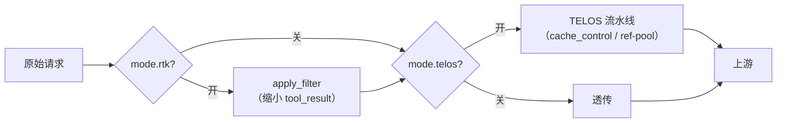

TELOS 稳住请求**前缀**（system / tools / 对话前缀）以赢得 KV cache。但每轮 agent 还会把大块工具输出——
bash / pytest / docker 日志——追加到对话的**尾部**。TELOS 吸收了
[rtk-ai/rtk](https://github.com/rtk-ai/rtk) 的思想，加了一个正交的 **RTK 输出过滤**层：在请求进入 TELOS
流水线之前，压缩 `tool_result` 中的大块重复输出。

<Note>
  两条线相互独立。TELOS 缩小你*再次*按全价支付的部分（前缀）；RTK 缩小你每轮新增的部分（工具尾部）。它们
  由 `TelosMode` 四态开关分别控制。
</Note>

## 四态开关

```python
@dataclass(frozen=True)
class TelosMode:
    telos: bool = True    # 运行 TELOS 流水线（cache_control / ref-pool）
    rtk:   bool = False   # 运行 RTK 工具结果过滤
```

| 标签 | telos | rtk | 含义 |
|---|:---:|:---:|---|
| `none` | ✗ | ✗ | 纯透传——代理一个字节都不改 |
| `telos` | ✓ | ✗ | 仅 TELOS 前缀缓存（代理默认）|
| `rtk` | ✗ | ✓ | 仅 RTK 工具过滤，不施加缓存标记 |
| `both` | ✓ | ✓ | 二者都开 |

未知或空值降级为默认 `telos`，保留开关引入前的历史行为。在线切换：

```bash
telos mode both    # 热重载正在运行的网关并持久化选择
```

## 过滤器

- **`RtkFilter`** —— 外壳调用 `rtk` 二进制（`rtk filter --command <cmd>` 读 stdin）。任何失败都降级为透传。
- **`FallbackFilter`** —— 零依赖的纯 Python 过滤器：连续重复行折叠为 `<line> (×N)`、首尾截断、保留 pytest
  摘要。保证 `rtk` 未安装时开关仍生效。
- **`CompositeFilter`** —— 先跑 rtk；若没省下字节，回退到 fallback。
- **`build_filter()`** —— rtk 可用 → `Composite(rtk, fallback)`，否则纯 `FallbackFilter`。

**阈值：** 短于 600 字符的输出不过滤；去重后超过 4000 字符的输出走首尾截断。

## 它如何接入代理



- `--mode` CLI 开关加 `X-Telos-Mode` 头（首个请求时粘到会话）。
- `mode.rtk` 开 → `apply_filter` 在 TELOS 流水线*之前*运行。
- `mode.telos` 关 → 跳过流水线直接透传。
- `apply_filter(raw, flt)` 是纯函数：深拷贝请求，改写每个 `tool_result` 的文本（字符串与块列表两种内容
  形态都支持），并从上一条 assistant 消息的 `tool_use` 查命令提示。
- `usage_log` 增加 `mode` / `compare_group` / `tool_output_reduction` 字段。

<Card title="架构" icon="sitemap" href="/zh/concepts/architecture">
  RTK 相对于 harness → bridge → engine 流水线的位置。
</Card>
