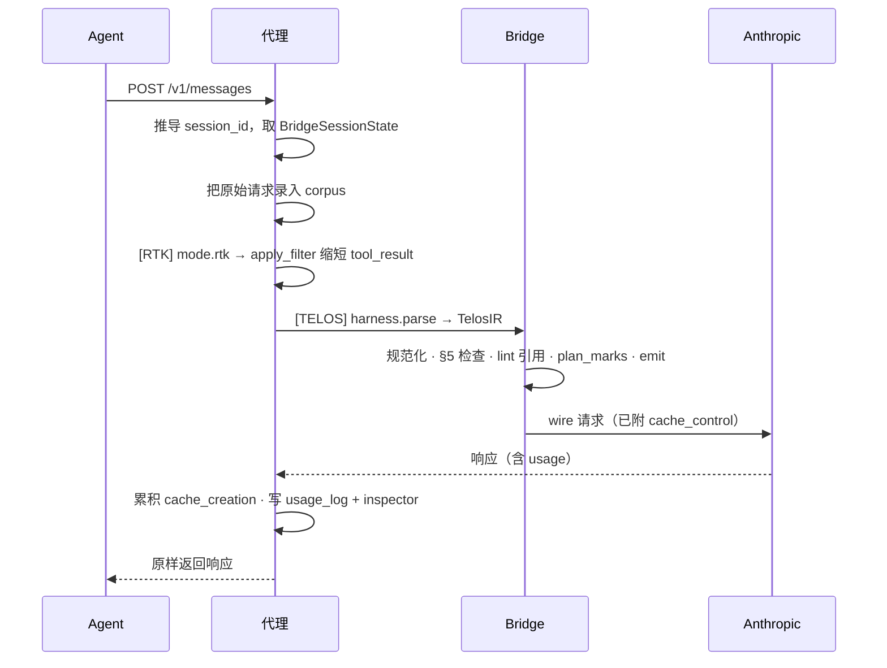

有两种方式把 TELOS 放在你的模型 API 前面。它们跑**相同的 TELOS 流水线**、**相同的状态累积**、**相同的
`cache_control` 注入**——唯一区别在进程边界、错误处理与流式。

<CardGroup cols={2}>
  <Card title="路径 B · HTTP 反向代理" icon="network-wired" href="/zh/guides/proxy-gateway">
    **推荐。** 零代码改动——把 `ANTHROPIC_BASE_URL` 指向本地网关。这正是 `telos init` 配置的。
  </Card>
  <Card title="路径 A · SDK 传输" icon="code" href="/zh/guides/sdk-transport">
    进程内。把 LLM 客户端换成 TELOS 传输；鸭子接口完全一致。
  </Card>
</CardGroup>

## 两者对比

| | 路径 B · 代理 | 路径 A · SDK 传输 |
|---|---|---|
| 集成方式 | `ANTHROPIC_BASE_URL` 环境变量，零代码改动 | 替换客户端对象 |
| 进程模型 | 进程外（独立网关）| 进程内 |
| 流式 | SSE 感知的反向代理 | 直接 SDK 流式 |
| 会话状态 | 按 `session_id` 存于 LRU 注册表 | 每个 transport 实例一个 `BridgeSessionState` |
| 适用 | 任何尊重 `ANTHROPIC_BASE_URL` / `OPENAI_BASE_URL` 的 harness | 你掌握源码的应用 |
| 失败行为 | 默认非严格：降级为透传 | 进程内抛出 |

<Note>
  两条路径共享同一个纯函数——`proxy/pipeline.py:process_anthropic_request(raw, ...)` 拆出
  parse → bridge → emit，消除两者间的 wire 漂移。
</Note>

## 一次请求的全程（路径 B，`mode=both`）

## 选哪个

- **你跑 CLI agent（Claude Code、Codex、OpenClaw、Hermes）。** 用路径 B——跑 `telos init` 就好。见
  [Harness 集成](/zh/guides/harnesses)。
- **你在用 Python 自建 agent。** 都行；路径 A 让一切留在进程内。见 [SDK 传输](/zh/guides/sdk-transport)。
