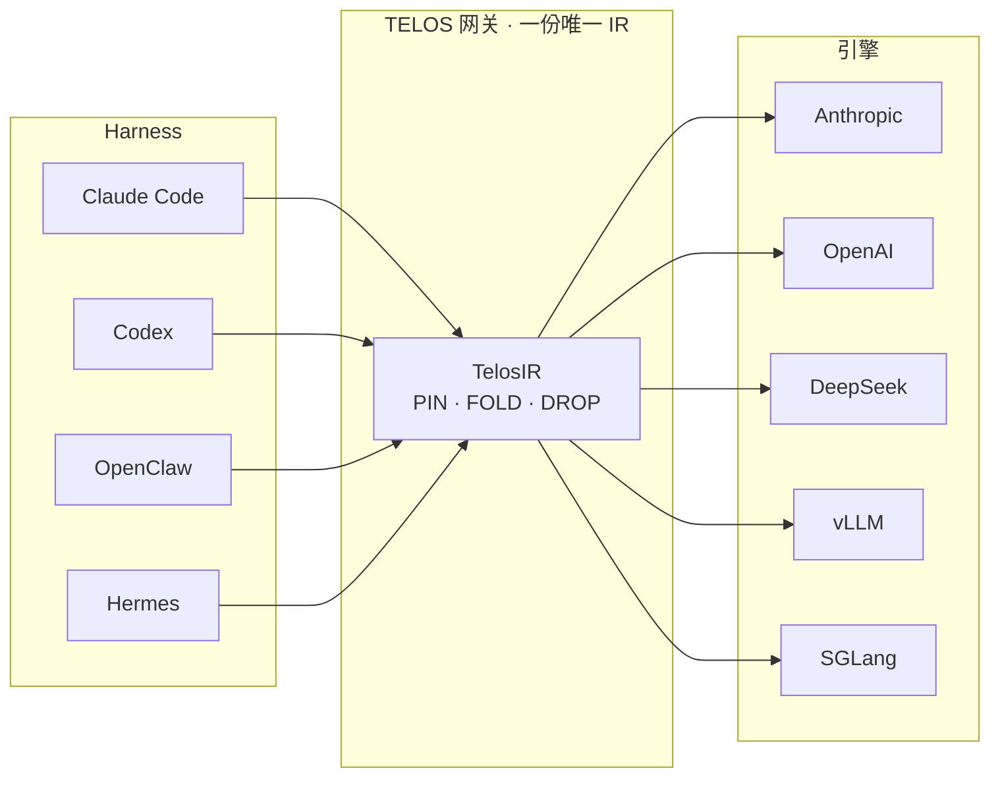

<Frame>
  
</Frame>

**一份唯一 IR——tools、system、turns 与 memory——可在 Anthropic · OpenAI · DeepSeek · vLLM ·
SGLang 上不加修改地运行。** 多数 agent 框架把 KV cache 当作推理引擎"也许会赏给你"的运行时礼物。TELOS
把它反转：缓存复用成为 *prompt 本身的结构性属性*。只要稳住真正稳定的字节，cache 就无法被失效。

<Note>
  真实 6 轮会话 **−92.3%**。成本按绝对 **\$/已解决请求** 记录——比例可以造，美元不行。来自
  [清华大学 LEAP Lab](https://www.leaplab.ai/)。
</Note>

<Columns cols={3}>
  <Card title="快速开始" icon="rocket" href="/zh/start/quickstart">
    三条命令完成安装、接入并查看节省。
  </Card>
  <Card title="协议" icon="sparkles" href="/zh/concepts/protocol">
    三色带与单调追加——为什么 cache *不会*被破坏。
  </Card>
  <Card title="支持矩阵" icon="layout-dashboard" href="/zh/reference/support-matrix">
    harness、前沿模型与自托管推理框架。
  </Card>
</Columns>

## 为什么是 TELOS

TELOS 只解决两件事。

<CardGroup cols={2}>
  <Card title="把 token 效率推到极限" icon="gauge-high">
    真实 6 轮会话节省 **−92.3%**；受控 48 次调用节省 **−36.6%（净省 −\$2.16）**。每一分钱都以绝对
    \$/已解决请求 记账。
  </Card>
  <Card title="把上下文主权还给你" icon="shield-halved">
    `TelosIR` 是引擎无关、可序列化、可移植的上下文表示——你的人设、你的工具、你的 20
    轮会话线程，全部刻在同一块**石碑**上。今天交给 Claude，明天搬到 DeepSeek，今晚跑在本地 vLLM。
  </Card>
</CardGroup>

## 核心能力

<CardGroup cols={3}>
  <Card title="三色带" icon="layer-group" href="/zh/concepts/bands">
    每个 block 在出生时即声明其缓存生命周期：PIN / FOLD / DROP。
  </Card>
  <Card title="单调追加" icon="arrow-down-wide-short" href="/zh/concepts/protocol">
    prompt 是一个只追加的流——已提交的字节绝不被修改。
  </Card>
  <Card title="多引擎适配" icon="plug" href="/zh/concepts/architecture">
    一份 IR 通达 Anthropic、OpenAI、DeepSeek、vLLM 与 SGLang。
  </Card>
  <Card title="RTK 输出过滤" icon="filter" href="/zh/concepts/rtk">
    一个正交的层，压缩重复的 `tool_result` 尾部。
  </Card>
  <Card title="节省看板" icon="chart-line" href="/zh/observability/savings-dashboard">
    离线 HTML，节省额钉死在绝对美元上。
  </Card>
  <Card title="零侵入代理" icon="network-wired" href="/zh/guides/proxy-gateway">
    把 `ANTHROPIC_BASE_URL` 指向本地网关——无需改代码。
  </Card>
</CardGroup>

## 凌晨 2 点：钱到底花到哪去了？

计数器爬到 2,847,103 个 token，而上面一行写着 `cache_read: 0`。整夜，每一轮都把同样的 4,000-token
system prompt **从头**喂给模型，按全价计费。把同一段 6 轮对话丢进 TELOS，翻两个开关：

| 模式 | 原始输入 token | cache_read | 6 轮成本 |
|---|:--:|:--:|:--:|
| passthrough（今天的默认）| 24,151 | 0 | **\$0.3623** |
| 启用 TELOS | 0 | 18,701 | **\$0.0281（−92.3%）** |

放大到 1,000 个会话：**\$362 → \$26**。

<Frame caption="今天 agent 的 token 效率仅约 25%——可复用的字节每轮都按全价重复计费。">
  
</Frame>

## 三步节省 90%

<Steps>
  <Step title="安装">
    ```bash
    # Linux / macOS / WSL2 / Android (Termux)
    curl -fsSL https://raw.githubusercontent.com/learningCatHD/telos-sdk/main/scripts/install.sh | bash
    # 或：pip install -U telos-sdk
    ```
  </Step>
  <Step title="接入">
    ```bash
    telos init
    ```
    自动探测 **claude-code / codex / openclaw / hermes**，向每个注入配置，并在后台启动本地网关。无需改动
    你的 agent 代码。
  </Step>
  <Step title="观察">
    ```bash
    telos dashboard
    ```
    在浏览器中打开离线 HTML 看板，按绝对美元展示每次调用的节省。
  </Step>
</Steps>

## 它们如何拼在一起



## 了解更多

<CardGroup cols={3}>
  <Card title="架构" icon="sitemap" href="/zh/concepts/architecture">
    harness → bridge → engine 的三层设计。
  </Card>
  <Card title="SWE-bench A/B" icon="flask" href="/zh/benchmark/swebench">
    预先登记研究：输入账单减半，修复率不回归。
  </Card>
  <Card title="CLI 参考" icon="terminal" href="/zh/reference/cli">
    每一个 `telos` 子命令与参数。
  </Card>
</CardGroup>
